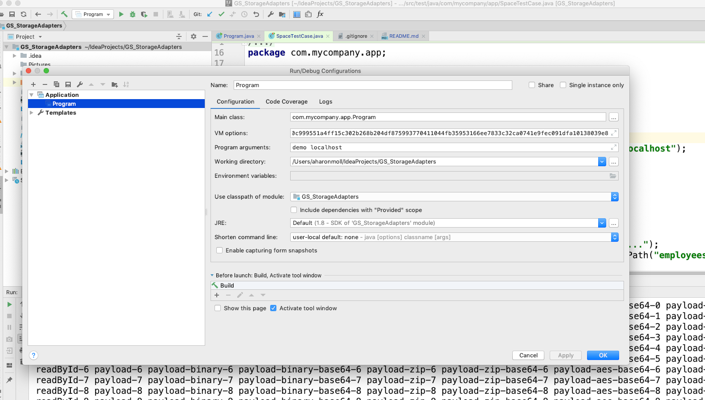

# GigaSpaces Storage Adapters Example

##### Add the following as a JVM parameter/option:
*   -Dcom.gs.property-storage.aes.passphrase=0b05308c9a00f07044416bad7a51bacd282fc5c0c999551a4ff15c302b268b204df875993770411044fb35953166ee7833c32ca0741e9fec091dfa10138039e8

##### Another option is to use:
*   -Dcom.gs.property-storage.aes.passphrase-path=~/passphrase.txt (passphrase will be inside the file)

##### Add space name and locators as Program Arguments

#### Please run:
    com.mycompany.app.Program.main()

